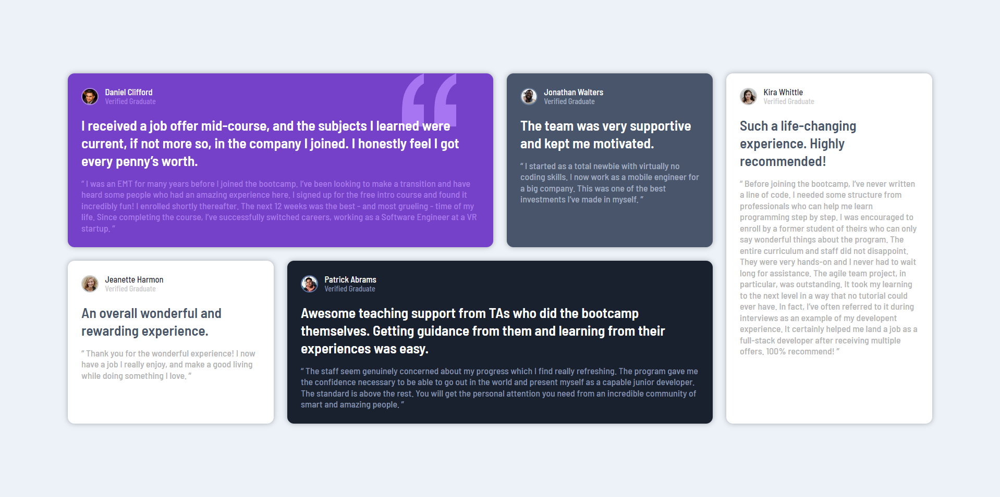
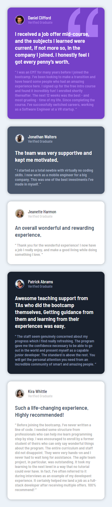

# Sección de testimonios

Este proyecto es una propuesta de solución para uno de los desafios de Frontend Mentor, todos los recursos utilizados fueron obtenidos mediante dicha plataforma.

Para este proyecto se presenta un sitio web en el que se muestran algunos testimonios de personas sobre algunos cursos/bootcamps que han realizado, mostrando un titulo llamativo y un parrafo explicando su experiencia.

## Contenidos

- [Descripción](#descripción)
  - [Desafío](#desafío)
  - [Screenshot](#screenshot)
  - [Links](#links)
- [Proceso](#proceso)
  - [Hecho con](#hecho-con)
  - [Lo que aprendí](#lo-que-aprendí)

## Descripción

### Desafío

El desafio propuesto fue diseñar un conjunto de tarjetas con información dentro de cuadriculas personalizadas, de manera que el tamaño de las tarjetas se adapte según las resoluciones de pantalla.

Se utilizó ```display: grid``` para ordenar cada tarjeta y establecer el tamaño para cada una de estas.

### Screenshot

#### Escritorio (1920x1080px)


#### Movil


### Links

- Sitio: [Sección de testimonios](https://f-avalos.github.io/Testimonials-Grid-Section/)

## Proceso

### Hecho con

- HTML
- CSS
  - Flexbox
  - Grid
  - Media Queries
  - Flujo de trabajo _Mobile-first_

### Lo que aprendí

Para este desafio aprendí a usar las propiedades ```grid-template-areas``` y ```grid-area``` para establecer cuadrillas personalizadas según la resolución de cada dispositivo, además de reutilizar conceptos como tamaños de contenedores y fuentes dinamicas.

Algo nuevo que aprendí fue a desarrollar este proyecto utilizando un flujo de trabajo ___Mobile-First___, es decir, iniciar el diseño de este sitio web desde una perspectiva de telefono celular, y mientras más aumente la resolución de pantalla se le añaden o modifican otras propiedades para mostrar una interfaz más personalizada, esto con ayuda de Media Queries para establecer _breakpoints_.